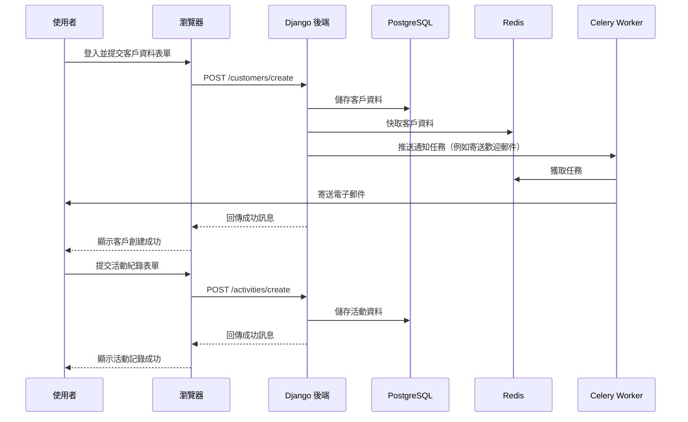

# FullStackDjangoCRM

這是一個使用 Django 和 Bootstrap 5 打造的現代化全端客戶關係管理（CRM）系統，透過 Docker 部署，專為中小型企業設計，幫助管理客戶、銷售、活動和報表，注重安全、效能與可擴展性。

[](https://opensource.org/licenses/MIT)
[](https://www.python.org/)
[](https://www.djangoproject.com/)
[](https://www.docker.com/)
[](https://github.com/BpsEason/FullStackDjangoCRM/actions)

## 專案簡介

FullStackDjangoCRM 是一個開源 CRM 系統，旨在提供高效的客戶關係管理解決方案，支援客戶資料與活動追蹤，未來將新增銷售與報表功能。採用響應式 Bootstrap 5 介面，搭配 Docker 部署，並支援國際化（預設繁體中文），簡單易用，適合企業與開發者。

## 功能特色

- **客戶管理**：建立、更新與追蹤客戶資料，包含聯繫資訊、互動紀錄與備註。
- **活動追蹤**：記錄與客戶相關的通話、會議與任務。
- **安全認證**：基於角色的存取控制（RBAC），使用 Argon2 密碼雜湊，防護 CSRF/XSS。
- **響應式介面**：採用 Bootstrap 5，支援行動裝置，操作流暢。
- **效能優化**：Redis 快取與 Celery 異步任務（例如電子郵件通知）。
- **可擴展部署**：Docker 與 Docker Compose 容器化，支援雲端或本地部署。
- **REST API**：透過 Django REST Framework 支援未來整合。
- **國際化**：支援多語言（預設：繁體中文 zh-hant），可透過 `settings.py` 切換。
- **Django 後台**：強大的管理介面，輕鬆管理客戶與活動。
- **未來規劃**：新增銷售管理（商機、報價、訂單）與報表（銷售漏斗、客戶分析）。

## 系統架構圖

以下 Mermaid 序列圖展示用戶創建客戶並記錄活動的流程，涵蓋前端、Django 後端、PostgreSQL、Redis 和 Celery 的交互。



## 技術棧

- **後端**：Django 5.1、Django REST Framework 3.15
- **前端**：Bootstrap 5.3、自訂 CSS/JS
- **資料庫**：PostgreSQL 16
- **快取**：Redis 7
- **任務佇列**：Celery 5.4（Redis 後端）
- **部署**：Docker、Docker Compose、Gunicorn 23、Nginx 1.25
- **安全性**：Argon2 密碼雜湊、django-environ、HSTS、安全 Cookie
- **其他工具**：django-bootstrap5、psycopg2-binary

## 環境需求

- Python 3.11+
- Docker 與 Docker Compose
- Git
- 程式碼編輯器（例如 VS Code）

## 安裝步驟（本地開發）

### 1. 複製專案

```bash
git clone https://github.com/BpsEason/FullStackDjangoCRM.git
cd FullStackDjangoCRM
```

### 2. 設定環境變數

複製並編輯 `.env`：

```bash
cp .env.example .env
```

關鍵配置：

```env
SECRET_KEY=your-secret-key-here
DEBUG=True
ALLOWED_HOSTS=localhost,127.0.0.1
DB_NAME=crm_db
DB_USER=postgres
DB_PASSWORD=postgres
DB_HOST=db
DB_PORT=5432
REDIS_URL=redis://redis:6379/0
CELERY_BROKER_URL=redis://redis:6379/0
CELERY_RESULT_BACKEND=redis://redis:6379/0
SECURE_SSL_REDIRECT=False
SESSION_COOKIE_SECURE=False
CSRF_COOKIE_SECURE=False
```

### 3. 建構並啟動服務

```bash
docker-compose up --build -d
```

### 4. 執行資料庫遷移

```bash
docker-compose exec web python manage.py makemigrations
docker-compose exec web python manage.py migrate
```

### 5. 建立超級用戶

```bash
docker-compose exec web python manage.py createsuperuser
```

### 6. 收集靜態檔案

```bash
docker-compose exec web python manage.py collectstatic --noinput
```

### 7. 訪問應用

- 前端：`http://localhost`
- 管理後台：`http://localhost/admin`（使用超級用戶帳密登入）

## 部署（生產環境）

### 1. 配置生產設定

更新 `.env`：

```env
DEBUG=False
ALLOWED_HOSTS=your-domain.com
SECURE_SSL_REDIRECT=True
SESSION_COOKIE_SECURE=True
CSRF_COOKIE_SECURE=True
```

生成安全的 `SECRET_KEY`：

```bash
python -c 'import secrets; print(secrets.token_hex(32))'
```

### 2. 設定 HTTPS

- 使用 Let's Encrypt 申請 SSL/TLS 憑證。
- 配置 Nginx 啟用 HTTPS 和 HSTS。

### 3. 靜態檔案

- 建議使用 CDN（如 Cloudflare、AWS S3）提供靜態檔案。
- 執行 `collectstatic`。

### 4. 雲端部署

- 將 Docker 映像推送至容器倉庫（例如 Docker Hub、AWS ECR）。
- 使用 AWS ECS、Google Cloud Run 或 VPS 部署。
- 範例指令：

```bash
docker-compose -f docker-compose.prod.yml up --build
```

### 5. 擴展

- 使用 Kubernetes 或 Docker Swarm 進行容器編排。
- 配置負載平衡器（例如 AWS ALB）以提升可用性。

### 6. CI/CD

- 使用 GitHub Actions 實現自動化測試與部署，參見 `.github/workflows/ci.yml`。

## 專案結構

```
FullStackDjangoCRM/
├── crm/
│   ├── customers/           # 客戶管理應用
│   ├── sales/              # 銷售管理應用（規劃中）
│   ├── activities/         # 活動追蹤應用
│   ├── reports/            # 報表應用（規劃中）
│   ├── templates/          # HTML 模板
│   ├── static/             # CSS、JS 檔案
│   ├── settings.py         # Django 配置
│   ├── urls.py             # URL 路由
│   ├── wsgi.py             # WSGI 配置
├── docker/
│   ├── Dockerfile          # Docker 配置
│   ├── nginx.conf          # Nginx 配置
├── .env                    # 環境變數
├── docker-compose.yml      # Docker Compose 配置
├── requirements.txt        # Python 依賴
├── manage.py               # Django 管理腳本
├── LICENSE                 # MIT 授權
└── README.md               # 專案說明
```

## 測試

執行單元測試驗證功能：

```bash
docker-compose exec web python manage.py test
```

目前涵蓋客戶與活動模型測試，歡迎貢獻更多測試案例。

## 安全功能

- **CSRF/XSS 防護**：Django 內建中介層保護。
- **密碼雜湊**：採用 Argon2 確保密碼安全。
- **HTTPS 強制**：支援 HSTS 與安全 Cookie。
- **環境變數**：使用 `django-environ` 儲存敏感資料。
- **RBAC**：限制資料存取，僅允許授權用戶（例如僅限創建者）。

## 效能優化

- **快取**：Redis 減少資料庫負載，支援查詢快取。
- **異步任務**：Celery 處理長時間任務（如郵件通知）。
- **靜態檔案**：Nginx 提供 Gzip 壓縮，支援 CDN。
- **資料庫**：PostgreSQL 搭配優化的 Django ORM 查詢。

## 國際化

- 預設語言：繁體中文（`zh-hant`）。
- 切換語言：修改 `crm/settings.py` 的 `LANGUAGE_CODE`（例如 `en-us`）。
- 新增翻譯後執行：

```bash
docker-compose exec web django-admin compilemessages
```

## 貢獻方式

歡迎貢獻！請遵循以下步驟：

1. Fork 本專案。
2. 建立功能分支：`git checkout -b feature/YourFeature`
3. 遵循 PEP 8（Python）與 Bootstrap 5（模板）規範。
4. 為新功能撰寫單元測試（使用 Django `TestCase`）。
5. 提交變更：`git commit -m 'Add YourFeature'`
6. 推送分支：`git push origin feature/YourFeature`
7. 開啟 Pull Request，清楚說明功能並關聯相關 issue。

請確保程式碼通過測試並包含文件。

## 授權

本專案採用 [MIT 授權](LICENSE)。

## 鳴謝

- 感謝 [Django](https://www.djangoproject.com/)、[Bootstrap 5](https://getbootstrap.com/) 和 [Docker](https://www.docker.com/) 提供強大工具。
- 靈感來自開源 CRM 方案與現代化網頁開發實務。
